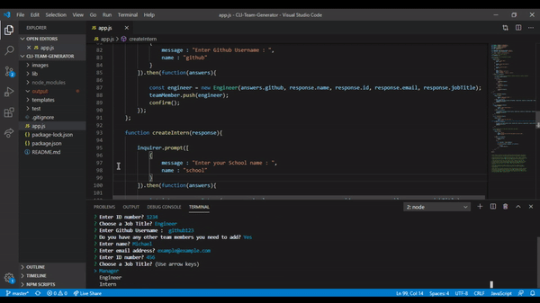

[]

# CLI-Team-Generator
 

## Table of Contents
<ul>
<li><strong>Description</strong></li>
<li><strong>Installation</strong></li>
<li><strong>Contributing</strong></li>
</ul>
 

## Description
 

 This is a simple Team Generator built using Node.js and Javascript that allows users to input information about their teammates, all done on CLI and then pushed into the browser. Users can input as many Managers, Engineers and Interns as they want, and a card will be generated and print on the browser's screen.

 

## Installation
 

Since it is all done on the Terminal, Users can clone the repo from Github and once they have it on their computer they will be able to run the application by opening the terminal and typing "node index.js", from there it is as simple as answering the prompts and once they are finished a HTML page named team.html will be generated.

 

## Contributing
 

No contributors.

 

